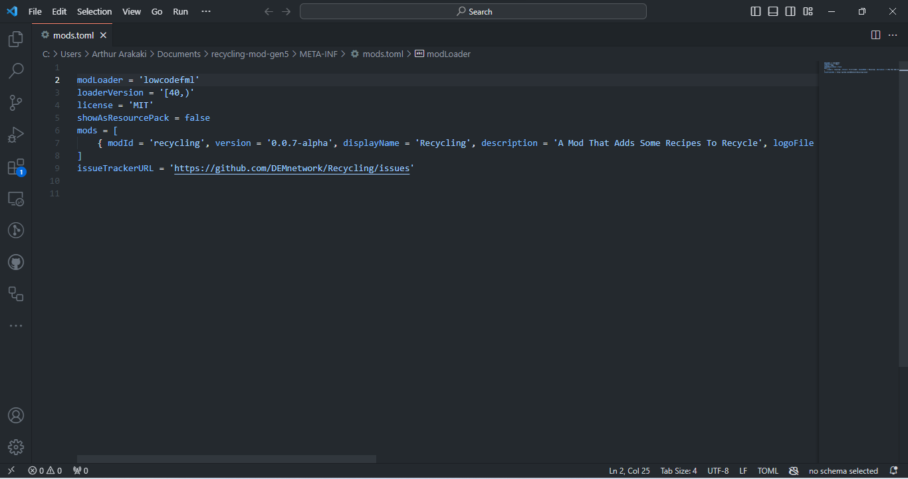

# Page 4

### 3.2 - Modifying The Metadata

_But Now I Want To Know How To Edit The Mod Metadata How Do I Do That?_

_**First You'll Have To Learn The Manifest Files Of Each Supported Modloader**_




\
The Forge Mod Loader Mod Manifest File Is <mark style="color:red;">`mods.toml`</mark>\
This Is Our <mark style="color:red;">`mods.toml`</mark> File:\



```toml

modLoader = 'lowcodefml'
loaderVersion = '[40,)'
license = 'MIT'
showAsResourcePack = false
mods = [
	{ modId = 'recycling', version = '0.0.7-alpha', displayName = 'Recycling', description = 'A Mod That Adds Some Recipes To Recycle', logoFile = 'recycling_pack.png', updateJSONURL = 'https://github.com/DEMnetwork/Recycling/raw/main/update.json', credits = '  ', authors = 'DEMnetwork', displayURL = 'https://modrinth.com/datapack/recycling' },
]
issueTrackerURL = 'https://github.com/DEMnetwork/Recycling/issues'
```


That Manifest File Contains The Mod\`s Metadata Such As:

* Display Name
* Mod ID
* Authors
* Issue Tracker
* License
* And More

And That FIle Is Important Without That File It Will Not Load The Mod!



The Fabric Manifest File Is <mark style="color:red;">`fabric.mod.json`</mark>\
This Is Our <mark style="color:red;">`fabric.mod.json`</mark>


```json
{"schemaVersion":1,"id":"recycling","version":"0.0.7-alpha","name":"Recycling","description":"A Mod That Adds Some Recipes To Recycle","authors":["DEMnetwork"],"contact":{"homepage":"https://dem-network-corporation.github.io/Recycling/","sources":"https://github.com/DEMnetwork/Recycling/tree/main","issues":"https://github.com/DEMnetwork/Recycling/issues"},"license":"MIT","icon":"recycling_pack.png","environment":"*","depends":{"fabric-resource-loader-v0":"*"}}
```


This File Include The Mod's Metadata Such As: Name,Version,license,authors,source code, and more



The <mark style="color:red;">`quilt.mod.json`</mark> Is The Quilt Modloader Manifest File\
This Is Our <mark style="color:red;">`quilt.mod.json`</mark>:


```json
{"schema_version":1,"quilt_loader":{"group":"com.demnetwork","id":"recycling","version":"0.0.7-alpha","metadata":{"name":"Recycling","description":"A Mod That Adds Some Recipes To Recycle","contributors":{"DEMnetwork":"Owner"},"contact":{"homepage":"https://dem-network-corporation.github.io/Recycling","sources":"https://github.com/DEMnetwork/Recycling/tree/main","issues":"https://github.com/DEMnetwork/Recycling/issues"},"wiki":"https://github.com/DEMnetwork/Recycling/wiki","icon":"recycling_pack.png"},"intermediate_mappings":"net.fabricmc:intermediary","depends":[{"id":"minecraft", "versions":">=1.20"},{"id":"quilted_fabric_api","versions":">=7.0.0+0.83.0-1.20"},{"id":"quilt_resource_loader","versions":"*","unless":"fabric-resource-loader-v0"}]}}
```


This File Include The Mod's Metadata Such As: Name,Version,license,authors,source code, and more



Our First Conclusion That's Without A Manifest File The Modloader Won't Load The Mod


Before Editing Make Sure You Have An Copy Of The Mod


#### 3.2.1 - How To Edit Metadata

Step 1 - Extract The Mod:\
To Extract The mod  You Can Use Softwares Like: 7-zip

After You Have Extracted The Files.

You'll View The Following Files:

<figure><picture><source srcset="../../../.gitbook/assets/image (2).png" media="(prefers-color-scheme: dark)"></picture><figcaption><p>Files That You'll View</p></figcaption></figure>

Step 2 -  Edit The Metadata Files:


This Step Varies Acording To The Modloader




Some Fields Are Critical So Any Change At That Fields May Make The Mod Broken.\
Fields That Aren't Critical:\
\- <mark style="color:blue;">`modId`</mark>\
\- <mark style="color:blue;">`version`</mark>\
\- <mark style="color:blue;">`description`</mark>\
\- <mark style="color:blue;">`logoFile`</mark>\
\- <mark style="color:blue;">`updateJSONURL`</mark>\
\-  And more

#### How To Modify The File


The FIle Is Located At META-INF/mods.toml


Open A Code Editor(Such As IntelliJ IDEA, VS Code, Eclipse, Or Any other).\
For Example i\`ll Use VS Code

<figure><figcaption><p>Example</p></figcaption></figure>

Then After Editing The Code You Can Make An Zip File\


<figure><figcaption><p>Make An Zip File</p></figcaption></figure>

Then Copy The Files

<figure><figcaption><p>Copying The Files</p></figcaption></figure>

Then Paste In The Your Zip File

<figure><figcaption><p>Pasting The Files</p></figcaption></figure>

Rename Change The File Extension From .zip To .jar

<figure><figcaption><p>Renaming The Zip File</p></figcaption></figure>

<figure><figcaption><p>File After Renamed</p></figcaption></figure>

Now Move To The %appdate%/.minecraft/mods/

<figure><figcaption><p>Moving To Mods Folder</p></figcaption></figure>



Work In Pogress



Work In Progress



Congratulations!!! You've Modified The Mod!!!
